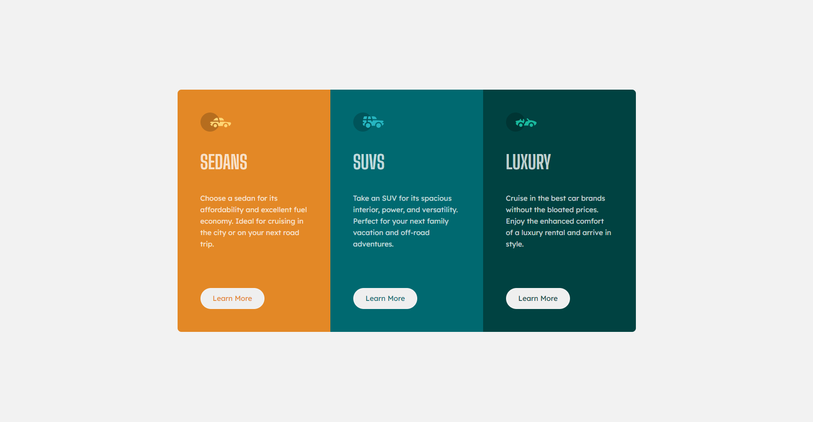

# Frontend Mentor - 3-column preview card component solution

This is a solution to the [3-column preview card component challenge on Frontend Mentor](https://www.frontendmentor.io/challenges/3column-preview-card-component-pH92eAR2-). Frontend Mentor challenges help you improve your coding skills by building realistic projects. 

## Table of contents

- [Overview](#overview)
  - [The challenge](#the-challenge)
  - [Screenshot](#screenshot)
  - [Links](#links)
- [Author](#author)

## Overview

### The challenge

Users should be able to:

- View the optimal layout depending on their device's screen size
- See hover states for interactive elements

### Screenshot

### Links

- [Solution URL](https://github.com/Gon3s/3-column-preview-card-component-main)
- Live Site URL: [Add live site URL here](https://your-live-site-url.com)

## Author

- Frontend Mentor - [@Gon3s](https://www.frontendmentor.io/profile/Gon3s)
- Twitter - [@Cuoq_Kevin](https://www.twitter.com/Cuoq_Kevin)
- LinkedIn - [@kevincuoq](https://www.linkedin.com/in/kevincuoq/)
